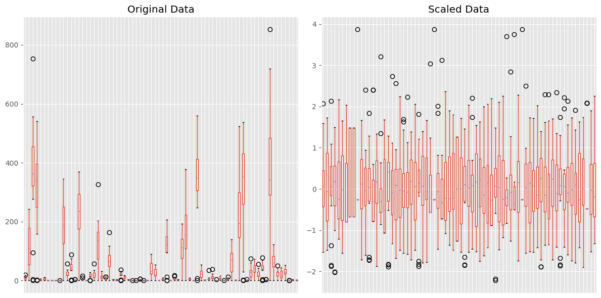
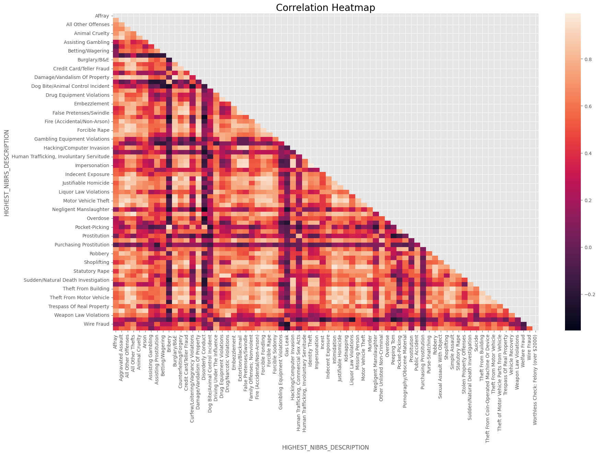

## **Charlotte's Neighborhood Crime Over Time Through Clustering**

### **Overview**
For Project 4, the goal is to work with clustering.  Writing is critical here, as the main goal will be to discuss your process, why you take certain steps (e.g., what preprocessing steps and why), and tell a story around your data and insights gained through both modeling (working with the clustering algorithms we learned about) and visualizations. Thus, your writing should portray your critical thinking about the data, the process, and what knowledge you find.

##  **Introduction**
Crime is a concern for many urban areas in the United States, and Charlotte is no exception. It is important to understand crime patterns and statistics to help communities and law enforcement agencies develop plans, allocate resources, and engage with the community to improve public safety. The Charlotte-Mecklenburg Police Department (CMPD) regularly publishes detailed crime reports. As of July 22, 2024, overall crime in Charlotte has seen a slight increase of 1% compared to the previous year. This includes various types of crimes, categorized broadly into violent crimes and property crimes.
Previously, [Project 1 ](https://pmb-7684.github.io/Data_Mining_Project_1/) Charlotte's Neighborhood Crime Over Time explored the data through exploratory data analysis. It focused on how much crime changed over time based on the different neghborhoods or divisions.  

For this project, the data will be explored through clustering analysis.  Again, the data explored how crime has evolved over time in different communities and how does location (such as open field, department store, hotel/motel, etc.) of the incident  within neighborhoods effective crime.  The difference is clustering will be used to explore if certain neighborhood belong to the same cluster and types of crimes likely to happen in those clusters.  

By determining communitites that are experiencing higher than normal levels of crime and specific location, the city, local law enforcement, and community can help allocated resources, develop plans and support community outreach to support all neighborhoods.

CMPD Data [Portal](https://data.charlottenc.gov/datasets/charlotte::cmpd-incidents-1/about)

City of Charlotte[ GIS](https://maps.mecknc.gov/openmapping/data.html)

### **What is clustering and how does it work?**
`Explain what clustering is and how it works (e.g., k-means and/or agglomerative that we have gone over in class).`  
`**How does this step relate to your modeling?**`   
In general, clustering is the process of grouping items with common characteristics into a group.

**k-Means** is an unsupervised algorithm used for clustering. The algorithm works by dividing a group of observations into a predetermined number of clusters. This number of clusters (k) is determined by the user. The user can either randomly select a number or use a method such as "elbow method" to calculate the number of clusters. Then k data are randomly selected to be centroid(center of the cluster). Each observation is assigned to a centroid based on distance to the closest centroid. Once all observations are assigned, recalculate the centroid by taking the average of the points assignment to the cluster. then determine the distance and reassign each observation. The algorithm is repeated until the centroids no longer move, no data points change clusters or the maximum number of iterations is reached.

**Agglomerative Hierarchical Clustering** works by splitting and merging the closest pairs of clusters until all the observations belong to a single cluster.

### **The Dataset**

The dataset is available from the city of Charlotte's open data portal. Data is available in various formats including CSV and contains both criminal and non-criminal incident reports from 2017 through 2024. It contains 688,973 observations and 29 features.

#### Some Domain and Variable Notes:

•	`X`, `Y` are unknown decimal values.

•	`INCIDENT_REPORT_ID` is the case number associated with the incident.

•	`LOCATION` is the physical address of the incident.

•	`X_COORD_PUBLIC`, `Y_COORD_PUBLIC` are unknown integer values.

•	`CMPD_PATROL_DIVISION` is the name of the division. It corresponds to numeric 'DIVISION_ID'.

•	`ADDRESS_DESCRIPTION` is a higher-level description of where the incident took place. Field mainly contained 'Location of occurrence' or 'Location where officer took report'

•	`NPA` is the Neighborhood Profile Area ID, a unique number that is assigned to different neighborhoods in Charlotte. It replaced the previous method of using the name of the community.

•	`PLACE_TYPE_DESCRIPTION` is a detailed description of 'LOCATION_TYPE_DESCRIPTION' which indicates if private resident, Gas station, etc.

•	`CLEARANCE_DETAIL_STATUS` is detailed description of 'CLEARANCE_STATUS' which provides how a case was cleared.

•	`HIGHEST_NIBRS_CODE` is the highest offense id number for the incident as defined by the FBI's National Incident-Based Reporting System (NIBRS)

•	`OBJECTID` is the index.

•	`GlobalID` is an unknown alpha-numeric value.

The shape of the orginal dataset is (688973, 29).

### **Pre-Processing**

By thoroughly cleaning the data, we will improve the accuracy of our model and save time by removing errors in advance.  The same pre-processing were completed on this project as completed on project one. Since, we are looking for clusters between the different neighborhoods (or districts) in the city, the number of features will be considerably smaller. Since most of the pre-processing was completed for project 1, below is a summary of task completed.  The following features were not used in the modeling or analysis and removed.

##### **Irrelevant**

`X` and `X_COORD_PUBLIC` contained the same value. The only differece was `X` was in decimal format and  `X_COORD_PUBLIC` was in integer format.  This was the same situation for '`Y` and `Y_COORD_PUBLIC`. 

For this project, there is no use for 'LATITUDE_PUBLIC' and '	LONGITUDE_PUBLIC'. 

`INCIDENT_REPORT_ID` represents the unique report number associated with each incident. 

`GlobalID` is an alphanumeric variable. It's purpose could not be determined. 

`OBJECTID` seems to be an index for the dataset. This column was removed and a seperate index was created during the pre-processing.

`LOCATION` (physical address of the incident), `CITY`, `STATE`, and `ZIP` can be replaced by the DIVISION_ID OR CMPD_PATROL-DIVISION which are better suited in describing where the incident took place. Those four features were removed.

##### **Missing Values**

After checking for missing data, there were six columns were missing values: STATE, ZIP, CMPD_PATROL-DIVISION, DATE_INCIDENT_END, ADDRESS_DESCRIPTION, and CLEARANCE DATE.  STATE and ZIP as stated above were not used and removed.

`CMPD_PATROL_DIVISION` is a more descriptive version of DIVISION_ID, so we can impute the missing information based on the current values in DIVISION_ID.  

`DATE_INCIDENT_END` indicates the date that the incident or cases was resolved.  I will impute those missing dates with today’s current date.  This will provide an accurate measure of the number of days that a case has been open, if I decide to create a column in the future.  For the same reason we will retain CLEARANCE DATE and impute it with the current date.

`ADDRESS_DESCRIPTION` can also be replaced by the CMPD_PATROL-DIVISION.

`LOCATION_TYPE_DESCRIPTION` provides a high-level location for the incident. This will be replace with a better feature.

##### **Data Types Checked**

All variables were of type `object`, except for YEAR, X_COORD_PUBLIC, Y_COORD_PUBLIC, LATITUDE_PUBLIC, LATITUDE_PUBLIC, and NPA.  Those data types are numeric.

##### **Index**

Normally, when data is imported, python automatically creates an index; however, the first row is index as 0 rather than 1. Now, the first row is indexed at 1 and the column is named ID.

The data set contains 14 features and 688,345 observations.

### **Data Understanding/Visualization**
`Use methods to try to further understand and visualize the data. Make sure to remember your initial problems/questions when completing this step.
While exploring, does anything else stand out to you (perhaps any surprising insights?)`   
When working with k-mean clustering it is important that all features are on the same scale. Recall with k-means algorithm it calculates the distance between points. If we failed to scale, then points in a higher range skew the calculations and likely those calculated would be inaccurate.

The x-labels were removed to reduce the amount of clutter on the axis since there are so many features. We can visually see the importance of standardization. Before standardization, our features ranged from 0 to over 1200. After standardization, all features are between -3 and 4. The standardized data will perform much better.

** Revisit to section ** I want to see pivot table, but I want a smaller size.

| CMPD_PATROL_DIVISION   |   Affray |   Aggravated Assault |   All Other Offenses |   All Other Thefts |   Animal Cruelty |   Arson |   Assisting Gambling |   Assisting Prostitution |   Betting/Wagering |   Bribery |   Burglary/B&E |   Counterfeiting/Forgery |   Credit Card/Teller Fraud |   Curfew/Loitering/Vagrancy Violations |   Damage/Vandalism Of Property |   Disorderly Conduct |   Dog Bite/Animal Control Incident |   Driving Under The Influence |   Drug Equipment Violations |   Drug/Narcotic Violations |   Embezzlement |   Extortion/Blackmail |   False Pretenses/Swindle |   Family Offenses; Nonviolent |   Fire (Accidental/Non-Arson) |   Forcible Fondling |   Forcible Rape |   Forcible Sodomy |   Gambling Equipment Violations |   Gas Leak |   Hacking/Computer Invasion |   Human Trafficking, Commercial Sex Acts |   Human Trafficking, Involuntary Servitude |   Identity Theft |   Impersonation |   Incest |   Indecent Exposure |   Intimidation |   Justifiable Homicide |   Kidnapping |   Liquor Law Violations |   Missing Person |   Motor Vehicle Theft |   Murder |   Negligent Manslaughter |   Other Unlisted Non-Criminal |   Overdose |   Peeping Tom |   Pocket-Picking |   Pornography/Obscene Material |   Prostitution |   Public Accident |   Purchasing Prostitution |   Purse-Snatching |   Robbery |   Sexual Assault With Object |   Shoplifting |   Simple Assault |   Statutory Rape |   Stolen Property Offenses |   Sudden/Natural Death Investigation |   Suicide |   Theft From Building |   Theft From Coin-Operated Machine Or Device |   Theft From Motor Vehicle |   Theft of Motor Vehicle Parts from Vehicle |   Trespass Of Real Property |   Vehicle Recovery |   Weapon Law Violations |   Welfare Fraud |   Wire Fraud |   Worthless Check: Felony (over $2000) |
|:-----------------------|---------:|---------------------:|---------------------:|-------------------:|-----------------:|--------:|---------------------:|-------------------------:|-------------------:|----------:|---------------:|-------------------------:|---------------------------:|---------------------------------------:|-------------------------------:|---------------------:|-----------------------------------:|------------------------------:|----------------------------:|---------------------------:|---------------:|----------------------:|--------------------------:|------------------------------:|------------------------------:|--------------------:|----------------:|------------------:|--------------------------------:|-----------:|----------------------------:|-----------------------------------------:|-------------------------------------------:|-----------------:|----------------:|---------:|--------------------:|---------------:|-----------------------:|-------------:|------------------------:|-----------------:|----------------------:|---------:|-------------------------:|------------------------------:|-----------:|--------------:|-----------------:|-------------------------------:|---------------:|------------------:|--------------------------:|------------------:|----------:|-----------------------------:|--------------:|-----------------:|-----------------:|---------------------------:|-------------------------------------:|----------:|----------------------:|---------------------------------------------:|---------------------------:|--------------------------------------------:|----------------------------:|-------------------:|------------------------:|----------------:|-------------:|---------------------------------------:|
| Airport                |        8 |                   14 |                  758 |               1260 |                1 |       0 |                    0 |                        0 |                  0 |         0 |             17 |                       20 |                         13 |                                      0 |                            135 |                   68 |                                  0 |                             4 |                          16 |                        855 |             19 |                     2 |                       109 |                             1 |                             0 |                  10 |               3 |                 0 |                               0 |          0 |                           0 |                                        0 |                                          0 |                7 |              22 |        0 |                   3 |             92 |                      0 |            1 |                       2 |               55 |                   336 |        0 |                        0 |                          1984 |          4 |             2 |               25 |                              0 |              0 |                29 |                         0 |                 4 |         5 |                            0 |            21 |              236 |                0 |                         10 |                                    9 |         7 |                    32 |                                            1 |                        128 |                                         129 |                         109 |                 34 |                     329 |               0 |            1 |                                      0 |
| Central                |       86 |                  603 |                 2749 |               3917 |               10 |      35 |                    0 |                        0 |                  0 |         1 |            907 |                      270 |                        332 |                                     23 |                           1795 |                  125 |                                  0 |                           173 |                         202 |                       1042 |             92 |                    52 |                       602 |                             6 |                             5 |                 184 |             110 |                25 |                               0 |          0 |                          14 |                                        0 |                                          3 |              189 |             148 |        2 |                  70 |            754 |                      5 |           33 |                      23 |              373 |                  1074 |       20 |                        0 |                          3858 |         85 |             5 |              274 |                            299 |              0 |                79 |                         0 |               105 |       474 |                            9 |          1768 |             2404 |                8 |                        196 |                                  127 |       121 |                   332 |                                            7 |                       4296 |                                         298 |                         402 |                 86 |                     230 |               0 |           24 |                                      9 |
| Davidson               |        0 |                    0 |                    0 |                  0 |                0 |       0 |                    0 |                        0 |                  0 |         0 |              0 |                        0 |                          0 |                                      0 |                              0 |                    0 |                                  0 |                             0 |                           0 |                          1 |              0 |                     0 |                         0 |                             0 |                             0 |                   0 |               2 |                 0 |                               0 |          0 |                           0 |                                        0 |                                          0 |                0 |               0 |        0 |                   0 |              0 |                      0 |            0 |                       0 |                0 |                     1 |        0 |                        0 |                             4 |          0 |             0 |                0 |                              0 |              0 |                 0 |                         0 |                 0 |         0 |                            0 |             0 |                0 |                0 |                          0 |                                    0 |         0 |                     0 |                                            0 |                          1 |                                           0 |                           0 |                  0 |                       0 |               0 |            0 |                                      0 |
| Eastway                |       90 |                  869 |                 3598 |               2327 |                6 |      37 |                    0 |                        0 |                  0 |         0 |           1552 |                      161 |                        274 |                                      5 |                           1732 |                   24 |                                  3 |                           201 |                         187 |                       1054 |             43 |                    40 |                       380 |                            31 |                            10 |                 137 |              80 |                12 |                               0 |          0 |                          17 |                                        1 |                                          1 |              247 |             134 |        1 |                  52 |            993 |                      1 |           54 |                      24 |              730 |                  1262 |       20 |                        0 |                          2459 |        136 |            12 |               46 |                             60 |              0 |                24 |                         0 |                42 |       728 |                            3 |          1250 |             2762 |               14 |                        246 |                                  264 |       152 |                   396 |                                           14 |                       2767 |                                         457 |                         217 |                135 |                     208 |               0 |           13 |                                      3 |
| Freedom                |      158 |                 1404 |                 3072 |               2788 |               26 |      87 |                    1 |                        0 |                  0 |         0 |           1999 |                      142 |                        379 |                                      5 |                           2201 |                   46 |                                  5 |                            98 |                         201 |                       1317 |            173 |                    47 |                       525 |                            20 |                            14 |                 182 |              80 |                27 |                               2 |          1 |                          14 |                                        2 |                                          3 |              248 |             164 |        2 |                  29 |           1049 |                      3 |           60 |                      17 |             1128 |                  1661 |       37 |                        0 |                          3299 |        207 |             2 |               39 |                             79 |              3 |                62 |                         0 |                58 |       590 |                            5 |          1288 |             2850 |                8 |                        278 |                                  427 |       134 |                   334 |                                           12 |                       2612 |                                         654 |                         212 |                350 |                     247 |               1 |            5 |                                      2 |
| Hickory Grove          |       61 |                  854 |                 2854 |               2035 |                8 |      53 |                    1 |                        0 |                  0 |         0 |           1447 |                      183 |                        366 |                                      3 |                           1977 |                   16 |                                  3 |                           120 |                         150 |                       1184 |             57 |                    56 |                       587 |                            21 |                            11 |                 171 |              62 |                17 |                               0 |          0 |                          19 |                                        0 |                                          1 |              279 |             172 |        0 |                  14 |            951 |                      4 |           46 |                       3 |             1025 |                  1176 |       35 |                        2 |                          2543 |        276 |             3 |               26 |                             95 |              0 |                58 |                         0 |                42 |       564 |                            8 |          1831 |             2990 |               14 |                        262 |                                  316 |       194 |                   339 |                                           12 |                       2251 |                                         458 |                         186 |                130 |                     190 |               1 |           13 |                                      3 |
| Huntersville           |        0 |                    6 |                   36 |                 15 |                0 |       2 |                    0 |                        0 |                  0 |         0 |             14 |                        3 |                          1 |                                      0 |                             19 |                    0 |                                  0 |                             3 |                           0 |                         21 |              0 |                     0 |                         7 |                             0 |                             0 |                   4 |               1 |                 1 |                               0 |          0 |                           0 |                                        0 |                                          0 |                3 |               4 |        0 |                   0 |              6 |                      0 |            1 |                       0 |                1 |                     6 |        0 |                        0 |                            55 |          2 |             0 |                2 |                              1 |              1 |                 0 |                         0 |                 1 |         7 |                            0 |             1 |               12 |                0 |                          1 |                                    4 |         1 |                     5 |                                            0 |                         36 |                                           3 |                           0 |                  5 |                       7 |               0 |            0 |                                      0 |
| Independence           |       65 |                  788 |                 2949 |               1840 |               13 |      38 |                    1 |                        0 |                  0 |         0 |           1346 |                      111 |                        302 |                                      1 |                           1660 |                   10 |                                  5 |                           122 |                          64 |                        581 |             83 |                    46 |                       516 |                            27 |                             6 |                 157 |              80 |                22 |                               0 |          0 |                          20 |                                        1 |                                          0 |              291 |             201 |        2 |                  15 |            936 |                      3 |           70 |                       7 |             1108 |                  1205 |       28 |                        5 |                          2474 |        223 |            12 |               23 |                            104 |              1 |                40 |                         0 |                36 |       450 |                            3 |          1344 |             2965 |                7 |                        151 |                                  344 |       284 |                   317 |                                            8 |                       2595 |                                         551 |                         133 |                127 |                     202 |               0 |           16 |                                      4 |
| Metro                  |      137 |                 1942 |                 3153 |               2842 |               29 |      78 |                    0 |                        0 |                  0 |         0 |           1854 |                      151 |                        333 |                                      2 |                           2486 |                   23 |                                  3 |                           178 |                         461 |                       2607 |            102 |                    26 |                       392 |                            17 |                            16 |                 158 |              98 |                34 |                               4 |          0 |                          19 |                                        0 |                                          1 |              171 |             150 |        1 |                  31 |           1194 |                      4 |           64 |                      27 |              991 |                  1911 |       69 |                        3 |                          3313 |         63 |             4 |               53 |                             57 |              4 |                84 |                         0 |                57 |       719 |                            5 |           974 |             3446 |               15 |                        586 |                                  357 |        61 |                   374 |                                            7 |                       2346 |                                         508 |                         228 |                344 |                     418 |               0 |           10 |                                      6 |
| North                  |       77 |                 1546 |                 3869 |               3439 |               40 |      65 |                    0 |                        1 |                  1 |         0 |           2456 |                      228 |                        596 |                                      0 |                           2746 |                   36 |                                  4 |                           164 |                         128 |                       1285 |            187 |                    70 |                       928 |                            18 |                            17 |                 201 |             112 |                17 |                               0 |          0 |                          27 |                                        0 |                                          4 |              594 |             348 |        0 |                  50 |           1516 |                      5 |           58 |                      10 |             1536 |                  2271 |       39 |                        1 |                          3039 |        187 |             8 |               37 |                            138 |              5 |                76 |                         0 |                36 |       576 |                            8 |          3317 |             3473 |               13 |                        277 |                                  486 |       233 |                   464 |                                           14 |                       4327 |                                         732 |                         198 |                304 |                     301 |               1 |           20 |                                      7 |
| North Tryon            |       59 |                 1525 |                 3788 |               2294 |               21 |      64 |                    2 |                        1 |                  1 |         0 |           1822 |                      172 |                        286 |                                      4 |                           2179 |                    9 |                                  0 |                           193 |                         276 |                       1617 |            103 |                    45 |                       410 |                            20 |                            16 |                 198 |             123 |                25 |                               1 |          0 |                          12 |                                        5 |                                          4 |              184 |             124 |        2 |                  42 |           1196 |                      5 |           78 |                      24 |             1131 |                  1750 |       52 |                        5 |                          2772 |        292 |             1 |               28 |                             94 |             32 |                46 |                         0 |                32 |      1108 |                            5 |          1230 |             3548 |               22 |                        483 |                                  322 |       154 |                   410 |                                           12 |                       2695 |                                         564 |                         158 |                249 |                     384 |               0 |           22 |                                      4 |
| Providence             |       78 |                  480 |                 2686 |               2941 |                7 |      23 |                    0 |                        0 |                  0 |         0 |           1180 |                      221 |                        471 |                                      8 |                           1298 |                   13 |                                  1 |                           166 |                          94 |                        559 |            119 |                    56 |                       585 |                            24 |                             5 |                 152 |              64 |                17 |                               0 |          0 |                          11 |                                        2 |                                          4 |              473 |             310 |        1 |                  42 |            861 |                      3 |           33 |                      18 |              769 |                   886 |       12 |                        1 |                          2793 |        156 |            16 |               48 |                             48 |              1 |                66 |                         0 |                40 |       256 |                            4 |          3047 |             2196 |                3 |                        113 |                                  252 |       167 |                   274 |                                           13 |                       3030 |                                         422 |                         263 |                 72 |                     126 |               0 |           29 |                                      5 |
| South                  |       16 |                  288 |                 2216 |               2627 |                5 |      18 |                    0 |                        1 |                  0 |         0 |           1044 |                      285 |                        418 |                                      7 |                           1444 |                    4 |                                  4 |                           168 |                          84 |                        516 |             79 |                    92 |                       927 |                            16 |                             9 |                 146 |              54 |                16 |                               0 |          0 |                          41 |                                        2 |                                          1 |              721 |             434 |        1 |                  35 |            774 |                      3 |           35 |                      16 |              679 |                   814 |       12 |                        1 |                          2418 |        265 |            12 |               31 |                            118 |              2 |                47 |                         0 |                22 |       183 |                            2 |          1765 |             1723 |                9 |                         62 |                                  579 |       446 |                   308 |                                            6 |                       3157 |                                         405 |                          98 |                 71 |                     106 |               0 |           33 |                                      3 |
| Steele Creek           |       76 |                 1482 |                 4454 |               4038 |               18 |      46 |                    1 |                        1 |                  1 |         0 |           2006 |                      233 |                        557 |                                      0 |                           2642 |                    9 |                                  1 |                           228 |                         164 |                       1113 |            249 |                    98 |                       931 |                            31 |                            24 |                 296 |             121 |                28 |                               2 |          0 |                          27 |                                        1 |                                          6 |              480 |             313 |        2 |                  49 |           1643 |                      6 |          116 |                      30 |             1271 |                  2553 |       41 |                        2 |                          4479 |        288 |            15 |               67 |                            185 |              5 |               127 |                         0 |                66 |      1050 |                            7 |          4195 |             4306 |               27 |                        223 |                                  421 |       328 |                   547 |                                           27 |                       5748 |                                         973 |                         322 |                303 |                     210 |               0 |           18 |                                     11 |
| University City        |      103 |                 1337 |                 6030 |               4322 |               32 |      58 |                    2 |                        1 |                  1 |         0 |           2765 |                      449 |                        706 |                                     23 |                           2956 |                   22 |                                  1 |                           140 |                         130 |                       1348 |            153 |                   100 |                      1309 |                            18 |                            14 |                 248 |             136 |                23 |                               0 |          0 |                          39 |                                        0 |                                          8 |              673 |             427 |        1 |                  67 |           1579 |                      8 |          133 |                      14 |             1130 |                  3018 |       52 |                        1 |                          4376 |        167 |            22 |               60 |                            116 |              1 |                66 |                         0 |                56 |       775 |                            5 |          3430 |             3992 |                9 |                        226 |                                  409 |       251 |                   624 |                                           25 |                       6823 |                                         969 |                         227 |                189 |                     312 |               0 |           19 |                                      2 |
| Westover               |       60 |                 1216 |                 2838 |               3080 |               14 |      71 |                    1 |                        0 |                  1 |         0 |           2040 |                      251 |                        432 |                                     10 |                           2311 |                   18 |                                  1 |                           209 |                         240 |                       1411 |            125 |                    37 |                       498 |                            25 |                            14 |                 165 |             101 |                17 |                               1 |          0 |                          16 |                                        1 |                                          4 |              251 |             181 |        1 |                  29 |           1150 |                      5 |           64 |                      23 |              802 |                  1725 |       34 |                        2 |                          3187 |        421 |             7 |               49 |                             72 |              5 |                78 |                         2 |                48 |       815 |                            4 |          2171 |             2779 |               12 |                        361 |                                  343 |       155 |                   405 |                                           10 |                       3742 |                                         686 |                         350 |                203 |                     229 |               0 |           12 |                                      6 |

### **Modeling(Clustering)**
`What model(s) do you use to try to solve your problem? Why do you choose those model(s)?For example, why choose k-means over agglomerative, or vice versa? Or perhaps experiment with both and discuss the pros/cons of each? You may also try experimenting with other methods of clustering not discussed in class.`
k-means

Pros
<ul type ="circle">
 <li>k-means is easier to use and understand in comparision to Agglomerative Hierarchical Clustering</li>
 <li>comment2</li>
</ul>

Cons
<ul type ="circle">
 <li>comment1</li>
 <li>comment2</li>
</ul>

Agglomerative Hierarchical Clustering

Pros
<ul type ="circle">
 <li>comment1</li>
 <li>comment2</li>
</ul>

Cons
<ul type ="circle">
 <li>comment1</li>
 <li>comment2</li>
</ul>

### **Storytelling (Clustering Analysis)**
`Use this section to further analyze your clusters.  What information or insights does it tell you? What have you learned? Were you able to answer your initial problems/questions (if so, discuss that)?`
#### **Principal Componenet Analysis (PCA)**
`Explain PCA and it's importance; reduce to (16,3)`

#### **k-means

### **Impact Section**
`Discuss the possible impact of your project. This can be socially, ethically, etc. It cannot be something like "our project has no impact" or "our project has no negative impact." Even the most well-intentioned projects *could* have a negative impact. We will not be checking for "right" or "wrong" answers, but showing your critical thinking.`

### **References**
1. https://maps.mecknc.gov/openmapping/data.html
2. https://towardsdatascience.com/geopandas-101-plot-any-data-with-a-latitude-and-longitude-on-a-map-98e01944b972
3. https://medium.com/@shankhanilborthakur/plotting-data-visualisation-on-the-map-of-india-using-geopandas-in-python-211bc88c1e4d
4. CompletedCluseringDemo.ipynb
5. https://www.statology.org/k-means-clustering-in-python/
